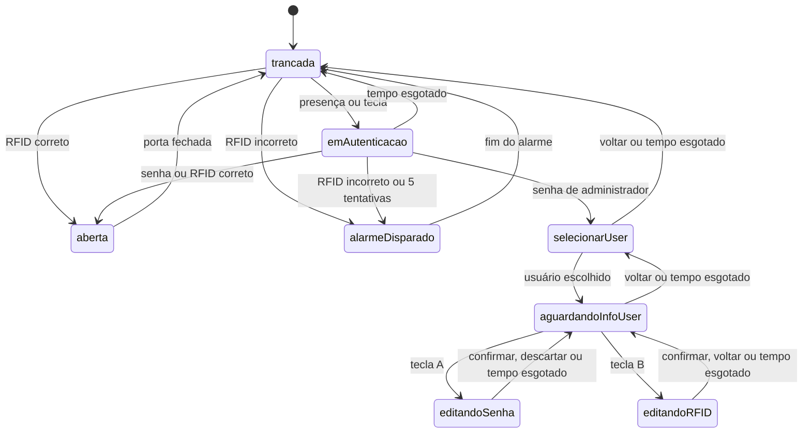

# SecureLink: fechadura eletrônica com FreeRTOS

Firmware de uma fechadura eletrônica para Arduino Mega 2560, feito em C++ com FreeRTOS. A
porta abre com senha de cinco dígitos ou com uma tag RFID, dispara um alarme depois de
tentativas erradas e tem um modo administrador para trocar a senha e a tag de cada usuário.

Projeto da disciplina PMR0120 (Introdução a Sistemas Embarcados) da Escola Politécnica da
USP, desenvolvido em equipe de quatro alunos no segundo semestre de 2025. O circuito roda
inteiro em simulação no [Wokwi](https://wokwi.com), sem precisar de hardware.

## O que ele faz

- **Detecta quem chega.** O sensor de presença (PIR) acende a luz e mostra no display o
  pedido de senha ou de RFID. Sem interação por cerca de 35 segundos, a fechadura volta ao
  repouso.
- **Autentica por senha.** A senha tem cinco dígitos, digitados no teclado 4×4. O display
  mostra um asterisco por dígito, a tecla `D` apaga o último e a tecla `*` cancela.
- **Autentica por RFID.** Uma tag cadastrada abre a porta direto, mesmo em repouso.
- **Dispara o alarme.** Uma tag desconhecida ou cinco senhas erradas seguidas acionam o
  buzzer e o LED vermelho piscando por 10 segundos.
- **Tranca de novo sozinha.** Quando o sensor de fim de curso indica porta fechada, o relé
  volta a travar a fechadura.
- **Tem modo administrador.** A senha de administrador leva a um menu em que se escolhe um
  usuário (1 a 4) e se troca a senha (`A`) ou a tag RFID (`B`). A senha nova é confirmada
  com `#`.

## Arquitetura

### Máquina de estados

O comportamento é uma máquina de estados finitos com 15 estados e 27 eventos, resolvida por
uma matriz de transição. Cada célula da matriz guarda o próximo estado e a ação a executar.
A matriz é montada na inicialização a partir de uma lista de transições
(`include/maquina_estados.h`). O que não está na lista mantém o estado atual e não faz
nada, então um evento inesperado nunca leva a um estado inválido.

Estes são os estados e as transições que a versão atual usa:

O enum também declara estados para cadastrar, excluir e renomear usuários. Eles fazem parte
do desenho original da máquina, mas ainda não têm transições.

### Agenda de eventos

Os sensores e o teclado não chamam a máquina de estados diretamente. Eles registram eventos
numa agenda ordenada pelo instante em que cada um deve acontecer (`acrescentaEvento`, em
`src/main.cpp`). Os tempos limite usam o mesmo mecanismo: entrar num estado agenda um
evento de "tempo esgotado" para alguns segundos depois, e sair dele remove esse evento
(`removeEvento`). Assim, um tempo limite é só mais um evento, tratado pela mesma tabela que
os outros.

### Tarefas do FreeRTOS

Seis tarefas dividem o trabalho e se coordenam por uma fila e por semáforos binários:

| Tarefa | O que faz |
|---|---|
| `taskObterEvento` | Tira da agenda os eventos que já venceram e os coloca na fila |
| `taskMaqEstados` | Lê sensores, teclado e serial, consome a fila e executa a transição |
| `taskBuzzer` | Toca o buzzer em intervalos enquanto o alarme está ativo |
| `taskBlinkVermelho` | Pisca o LED vermelho durante o alarme |
| `taskBlinkVerde` | Pisca o LED verde enquanto a fechadura espera a autenticação |
| `taskBlink` | Pisca o LED de "ligado" a cada segundo |

As tarefas de buzzer e de LED ficam bloqueadas num semáforo e só rodam quando uma ação da
máquina de estados as libera.

### Abstração de hardware

Cada componente é uma classe em `include/componentes.h` (`Teclado`, `Display`, `Led`,
`Relay`, `PIR`, `Buzzer`, `FimDeCurso`, `RFID`). As ações da máquina de estados, em
`src/acoes.cpp`, chamam esses métodos em vez de escrever nos pinos.

## Hardware

| Componente | Pino no Mega 2560 |
|---|---|
| Teclado matricial 4×4 | linhas em A15 a A12, colunas em A11 a A8 |
| Display LCD 16×2 com I2C | SDA/SCL, endereço `0x27` |
| Sensor de presença PIR | 7 |
| Fim de curso da porta (botão no simulador) | 2 |
| Relé da fechadura | 13 |
| Buzzer | 6 |
| LEDs de ligado, lâmpada, verde e vermelho | 9, 10, 11 e 12 |

O diagrama completo do circuito está em `SecureLink fechadura/diagram.json`.

**Sobre o RFID:** o Wokwi não tem leitor RFID. No simulador, a leitura de uma tag é feita
digitando o código dela no monitor serial e apertando Enter. A verificação da tag é a mesma
que um leitor físico usaria; só a origem do código muda.

## Como rodar

Você precisa do [VS Code](https://code.visualstudio.com) com as extensões
[PlatformIO](https://platformio.org) e
[Wokwi Simulator](https://docs.wokwi.com/vscode/getting-started). O Wokwi pede uma licença
gratuita na primeira vez.

1. Abra a pasta `SecureLink fechadura` no VS Code.
2. Compile com o PlatformIO (`pio run`, ou o botão Build). As bibliotecas
   `LiquidCrystal_I2C`, `Keypad` e `FreeRTOS` são baixadas sozinhas, conforme o
   `platformio.ini`.
3. Abra o `diagram.json` e inicie a simulação. O `wokwi.toml` já aponta para o firmware
   compilado.

### Usuários de teste

Os usuários vêm fixos em `include/usuarios.h` e são carregados na inicialização. São dados
de teste, só para a simulação.

| Usuário | Senha | Tag RFID |
|---|---|---|
| 0 (administrador) | `12345` | `BD 31 15 2A` |
| 1 | `11111` | `BD 31 15 2B` |
| 2 | `22222` | `BD 31 15 2C` |
| 3 | `33333` | `BD 31 15 2D` |
| 4 | `44444` | `BD 31 15 2E` |

Um roteiro curto para ver tudo funcionando:

1. Acione o PIR (ou aperte qualquer tecla) e digite `11111`. A porta abre.
2. Aperte o botão de fim de curso. A porta tranca de novo.
3. Digite cinco senhas erradas seguidas para ver o alarme.
4. Digite `12345` para entrar no modo administrador, escolha o usuário `2`, aperte `A`,
   digite uma senha nova e confirme com `#`.
5. Aperte `*` duas vezes para sair do menu. No monitor serial, digite `BD 31 15 2C` e aperte
   Enter para abrir com a tag do usuário 2.

## Limitações conhecidas

- Os usuários ficam só na memória. Trocas de senha e de tag se perdem ao reiniciar, porque o
  projeto não grava na EEPROM.
- Cadastrar, excluir e renomear usuários estão previstos na máquina de estados, mas não
  foram implementados.
- `include/usuarios.h` lista seis usuários, mas `MAX_USUARIOS` é 5, então o último não é
  carregado.
- Os tempos limite estão escritos direto nas ações (35 s na autenticação, 30 s nos menus e
  10 s no alarme). As constantes `TIMEOUT_*` de `definicoes.h` não são usadas.

## Equipe

Iago Nunes Cardoso, Gabriel Senna, Luis Guilherme Yamamoto e Tarsila Gramacho Sakata Namiki,
na disciplina PMR0120 da Escola Politécnica da USP.
